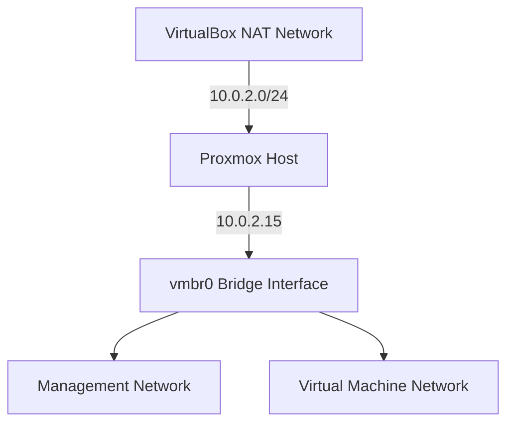

# Proxmox Enterprise Home Lab 🖥️

<div align="center">
 
  <p><em>Proxmox VE Web Interface - Home Lab Environment</em></p>
</div>

## Project Overview 🎯
Building an enterprise-level home lab environment using Proxmox VE (Virtual Environment) as the hypervisor. This project demonstrates practical implementation of virtualization, network segmentation, and infrastructure management in a controlled environment.

## Infrastructure Details 🌐

### Base System Configuration
| Component | Details |
|-----------|---------|
| Hypervisor | Proxmox VE |
| Type | Type 1 (Bare Metal) in VirtualBox |
| Network | NAT with Port Forwarding |
| Management | Web Interface (Port 8006) |

### Network Architecture


## Implementation Progress ✅

### Completed Steps
- [x] Base Infrastructure Setup
  - VirtualBox VM Configuration
  - CPU: 2+ cores
  - RAM: 4GB
  - Storage: 50GB
  - Network: NAT with port forwarding

- [x] Network Configuration
  ```bash
  # Network Bridge Configuration
  auto vmbr0
  iface vmbr0 inet static
          address 10.0.2.15/24
          gateway 10.0.2.2
          bridge-ports enp0s3
          bridge-stp off
          bridge-fd 0
  ```

- [x] Repository Setup
  - Configured community repository
  - Updated system packages
  - Resolved initial networking challenges

### Port Forwarding Details
| Service | Host Port | Guest Port | Guest IP |
|---------|-----------|------------|----------|
| Web Interface | 8006 | 8006 | 10.0.2.15 |

## Technical Implementation 🛠️

### Initial Setup Process
1. VirtualBox VM Creation
   - Allocated resources
   - Configured networking
   - Enabled virtualization features

2. Proxmox Installation
   - Base system setup
   - Network configuration
   - Repository configuration

### Network Configuration
```bash
# /etc/network/interfaces
auto lo
iface lo inet loopback

auto enp0s3
iface enp0s3 inet manual

auto vmbr0
iface vmbr0 inet static
        address 10.0.2.15/24
        gateway 10.0.2.2
        bridge-ports enp0s3
        bridge-stp off
        bridge-fd 0
        dns-nameservers 8.8.8.8 1.1.1.1
```

## Future Implementation Plans 📋

### Phase 1: Network Infrastructure
- [ ] pfSense Firewall Deployment
- [ ] VLAN Configuration
  - VLAN 10: Management
  - VLAN 20: User Network
  - VLAN 30: DMZ
  - VLAN 40: Storage

### Phase 2: Core Services
- [ ] DNS Server Implementation
- [ ] DHCP Server Setup
- [ ] Network Monitoring System
- [ ] Backup Solution

## Skills Demonstrated 🎯
- Hypervisor Installation & Configuration
- Network Infrastructure Design
- System Administration
- Troubleshooting
- Technical Documentation

## Tools & Technologies Used 🔧
- Proxmox VE
- VirtualBox
- Linux Networking
- Bridge Configuration
- NAT Networking

## Resources 📚
- [Proxmox Documentation](https://www.proxmox.com/en/proxmox-ve/documentation)
- [VirtualBox Manual](https://www.virtualbox.org/manual/)
- [pfSense Documentation](https://docs.netgate.com/pfsense/en/latest/)

## Environment Verification Commands 🔍
```bash
# Network Verification
ip a                     # View network interfaces
ip route                 # View routing table
ping 8.8.8.8            # Test internet connectivity

# Access Verification
curl -k https://localhost:8006  # Test web interface access
```

## Author Notes 📝
This documentation will be updated as the project progresses. Future updates will include:
- Detailed network diagrams
- Service configurations
- Performance metrics
- Security implementations

---
<div align="center">
  <p><strong>Project Status:</strong> In Progress 🚧</p>
  <p>Last Updated: November 10, 2024</p>
</div>
